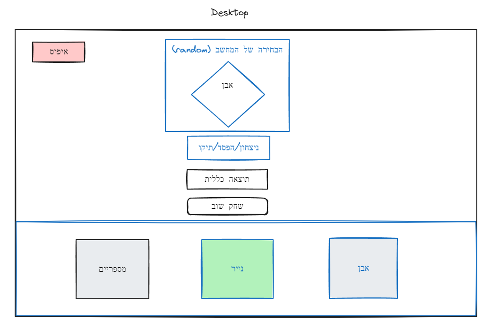
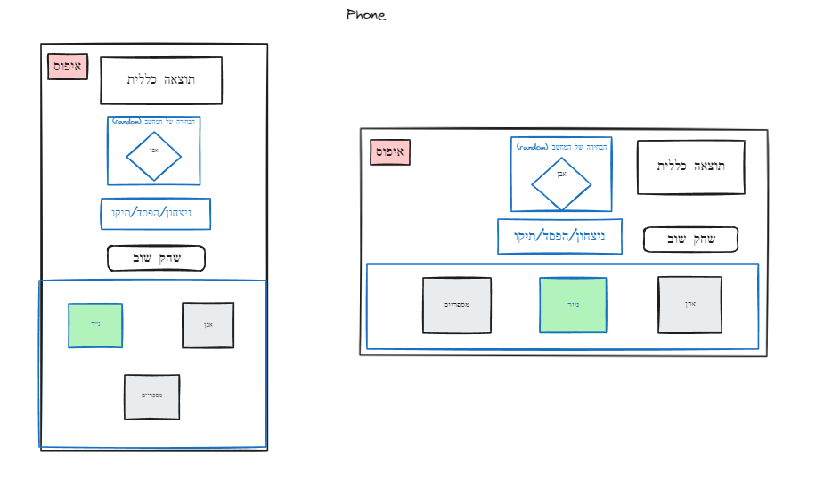
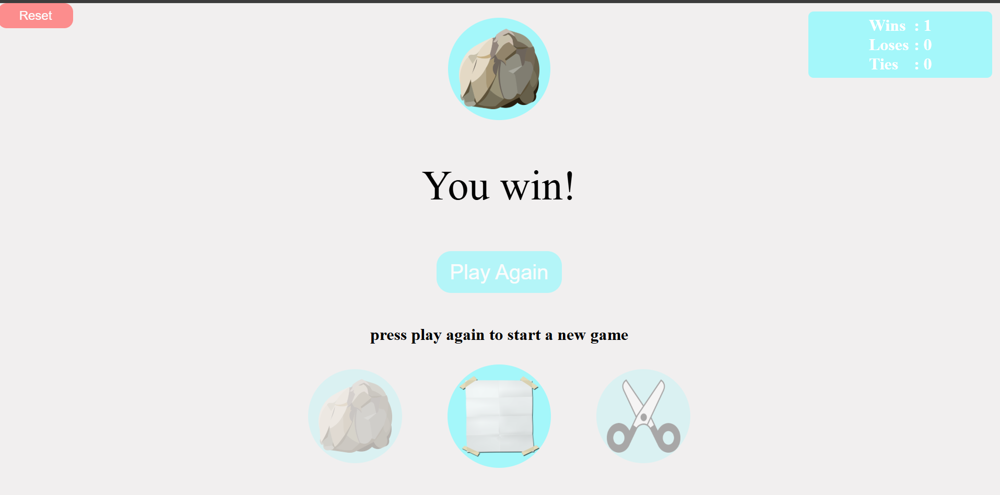
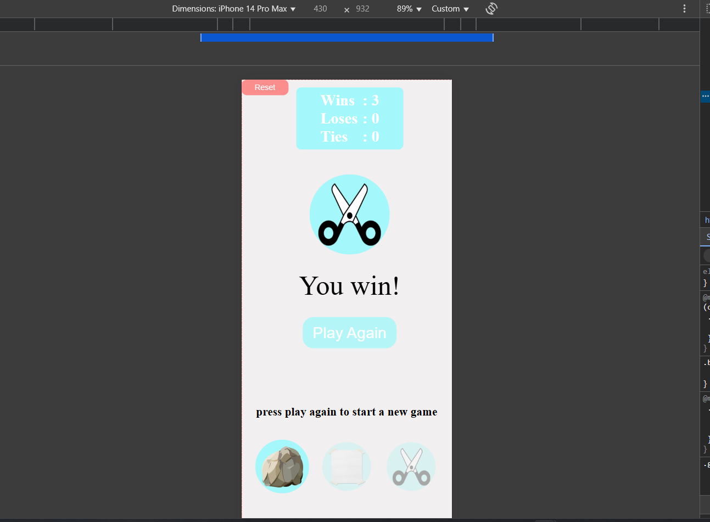

# ✊✋✌️ Rock-Paper-Scissors 🎮

A classic Rock-Paper-Scissors game built using **HTML**, **SCSS**, and modern **JavaScript (ES6+)**, with a strong focus on the **MVC architecture**. The game features a fully **responsive design**, ensuring a smooth experience on both desktop and mobile devices.---
---

## Live Demo 🌐 
- Try out the game here: [rock-paper-scissors Game Live Demo](https://adimalka14.github.io/rock-paper-scissors/)
---
## Features And Technologies 🚀 

### 🎮 Game Features
-  Classic Rock-Paper-Scissors gameplay with dynamic UI interactions.
-  Randomized computer choices for fair gameplay.
-  Smooth animations & UI transitions.

### 💻 Tech Stack
-  **JavaScript (ES6+)** – Modern, modular, and clean code.
-  **SCSS** – Organized, maintainable, and fully responsive styling.
-  **Vanilla JavaScript** – Direct and optimized DOM manipulation.

### 📂 Project Architecture:
- **MVC** (Model-View-Controller) Ensuring modularity, readability, and maintainability.

### 🛠 Development Tools:
- **Live Server** – For instant changes and live testing.
- **SCSS Compilation** – sass --watch for automatic style updates.
- **Prettier** – For consistent and well-formatted code.

---
## Getting Started 🛠️
Follow these steps to set up and run the project locally:

### Requirements
- Node.js version 20.12+

1. Clone the repository:
   ```bash
   git clone https://github.com/username/rock-paper-scissors.git
   cd rock-paper-scissors

2. Install dependencies:

   ```bash
   npm install
3. Compile **SCSS** (if needed):
   ```bash
   npm run sass:compile

4. open **index.html** in your browser
---

## UI Plan 🧠
### 🖥️ Desktop Layout

### 📱 Mobile Layout


## Final UI Implementation

### 🖥️ Desktop View

### 📱 Mobile View

